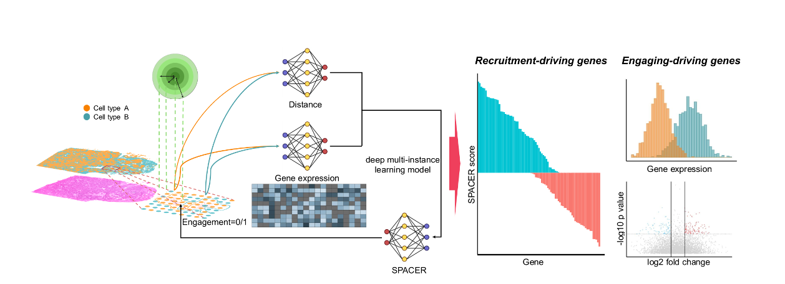

Welcome to SPACER's documentation!
===================================

**SPACER** (Spatial Analysis of Cellular Engagement and Recruitment) is a multi-instance deep learning framework 
developed to elucidate the molecular and spatial determinants of cellular recruitment and engagement 
within tissue microenvironments.

SPACER integrates high-dimensional spatial transcriptomics data with biologically informed multi-instance learning 
to model how cells interact and localize in complex tissues such as tumors and inflamed hearts.

For installation instructions and getting started examples, please see below.

.. note::

   This project is under active development.  
   For questions, feature requests, or contributions, please visit the 
   `SPACER GitHub repository <https://github.com/yaober/SPACER>`_.

---

Documentation Overview
----------------------

.. toctree::
   :maxdepth: 2
   :caption: Main Sections

   installation
   quick_start
   data_preparation
   build_model/index

---

Build Your Own SPACER Model
---------------------------

SPACER allows users to train their own models on customized datasets.  
This process involves three main stages: **data loading**, **training**, and **prediction**.

.. toctree::
   :maxdepth: 2
   :caption: Model Development Guide

   build_model/data_loading
   build_model/training
   build_model/prediction
